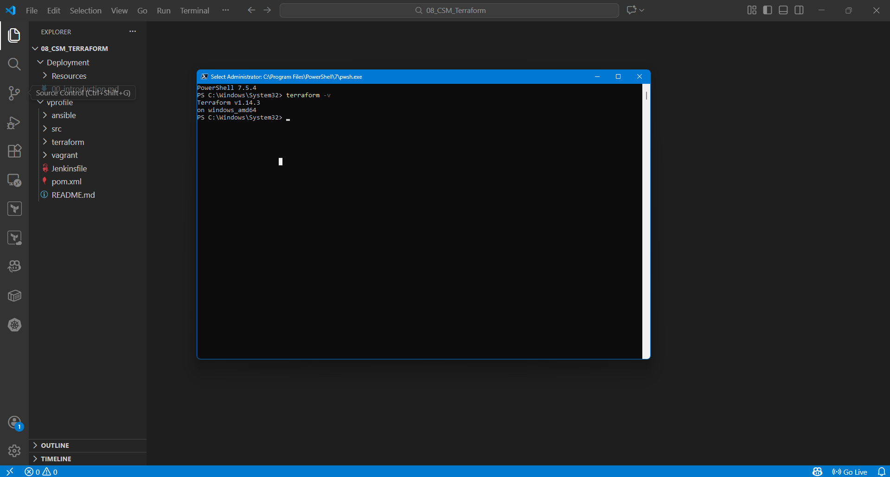
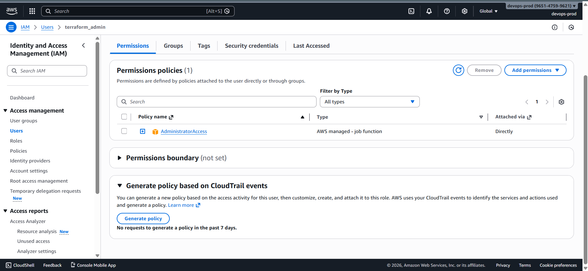
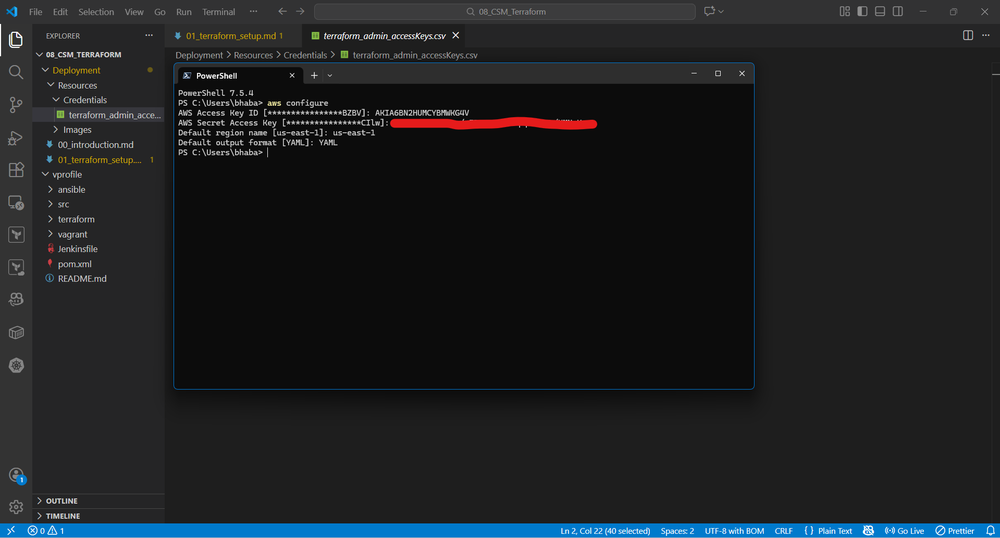

# Terraform Setup for AWS Infrastructure Automation

This section explains how to **prepare your local system and AWS account** to start building and managing cloud infrastructure using **Terraform**.

### Purpose of This Setup

In this project, Terraform will be used to:

- Provision AWS infrastructure using code
- Maintain a **centralized infrastructure state**
- Apply changes safely and repeatedly
- Eliminate manual configuration errors

### Installing Terraform CLI

#### Windows (Chocolatey)

```powershell
choco install terraform
```

> Run PowerShell **as Administrator**.

#### Verify Installation

```bash
terraform --version
```

Any recent Terraform version is acceptable. **Exact version matching is not required** for this project.



### AWS Authentication for Terraform

Terraform requires **programmatic access** to AWS using access keys.
This is achieved by creating an IAM user and configuring credentials locally.

### Step 1: Create an IAM User for Terraform

Navigate to **AWS Identity and Access Management** in the AWS Console.

#### User Configuration

- Username: `terraform-admin`
- Access type: **Programmatic**
- Permissions:

  - `AdministratorAccess`

> For learning purposes, Terraform needs full permissions to create and manage AWS resources.



### Step 2: Generate Access Keys

1. Open the IAM user
2. Go to **Security credentials**
3. Create an **Access Key**
4. Select:

   - **Command Line Interface (CLI)**

Save the following securely:

- Access Key ID
- Secret Access Key

⚠️ **Important Notes**

- The secret key is displayed **only once**
- Store it securely
- Delete the IAM user after completing the project to avoid security risks

---

## Step 3: Configure AWS CLI Locally

Terraform reads AWS credentials from the local AWS CLI configuration.

Run:

```bash
aws configure
```

Enter the following values:

- AWS Access Key ID
- AWS Secret Access Key
- Default region: `us-east-1`
- Output format: `YAML`

Credentials are stored locally at:

```
~/.aws/credentials
```


