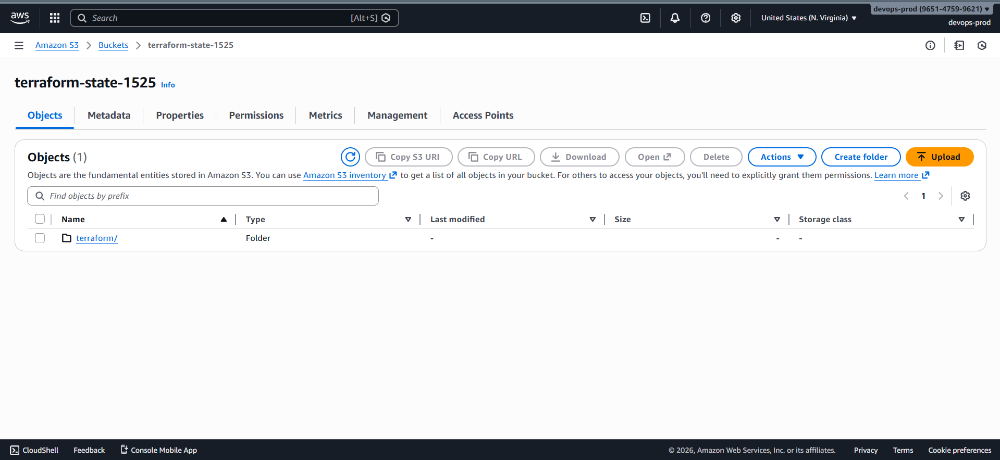
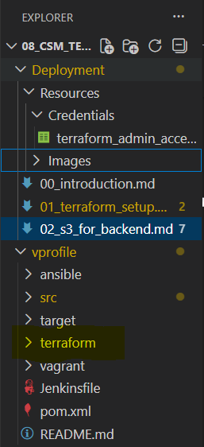
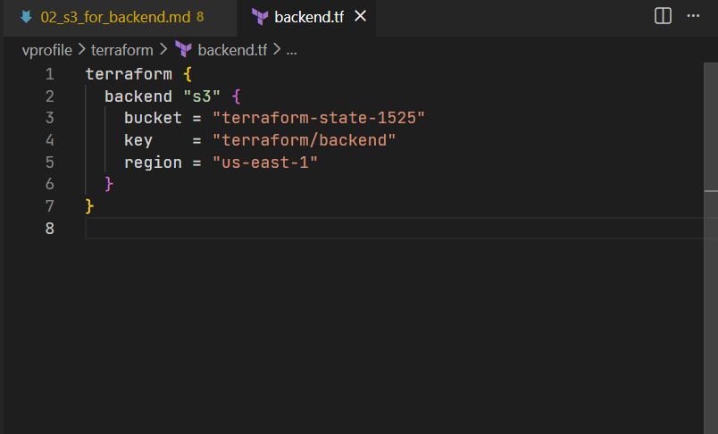
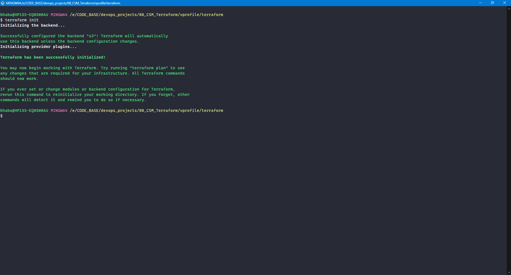

# Terraform Remote State Management (Backend Configuration)

This section explains how to configure a **remote backend using Amazon S3** for collaborative, production-grade workflows.

### Default Behavior: Local State (The Problem)

By default, Terraform stores `terraform.tfstate` **locally** in the working directory.

#### Why Local State Is a Risk

- Not shared across team members
- No single source of truth
- High risk of conflicting changes
- Easy to overwrite, delete, or lose
- Unsafe for team-based or production workflows

### Solution: Terraform Backend

A **Terraform backend** stores state **remotely and centrally**.

#### Benefits of a Remote Backend

- Shared state across teams
- Consistent and reliable infrastructure view
- Safer collaboration
- Optional state locking (prevents concurrent writes)

### Remote State Architecture (S3)

```
Local Terraform CLI
        |
        v
Terraform Backend (S3)
        |
        v
terraform.tfstate (shared)
```

All users interact with the **same centralized state file**.

### Step 1: Create an S3 Bucket

1. Open AWS Console → S3

2. Click **Create bucket**

3. Provide a **globally unique name**, for example:

   ```
   terraform-state-<unique-number>
   ```

4. Region: `us-east-1`

5. Create the bucket

### Step 2: Create a Folder in the Bucket

1. Open the S3 bucket
2. Click **Create folder**
3. Folder name:

   ```
   terraform
   ```

This folder will store the Terraform state file.



## Step 3: Prepare Local Terraform Project Directory

1. Create a local project directory, for example:

   ```
   terraform
   ```

2. Open the folder in **VS Code**

3. All Terraform configuration files will live here



### Step 4: Configure the Terraform Backend

Create a file named:

```
backend.tf
```



### Step 5: Initialize Terraform Backend

From the project directory, run:

```bash
terraform init
```

### Expected Result

```
Successfully configured the backend "s3"
```

Terraform now reads and writes state from S3 instead of local disk.


