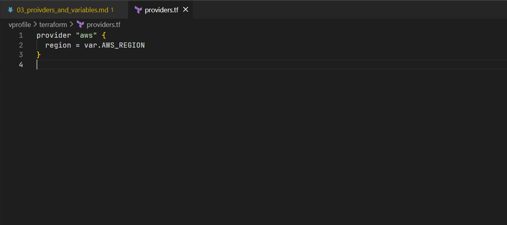
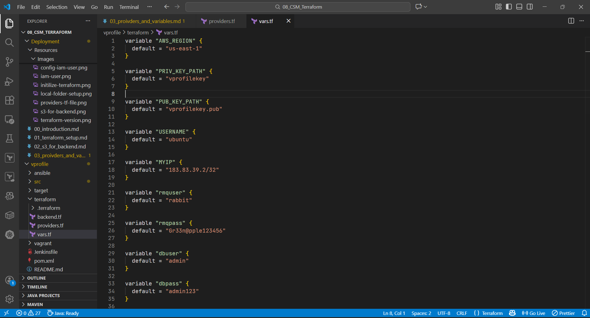
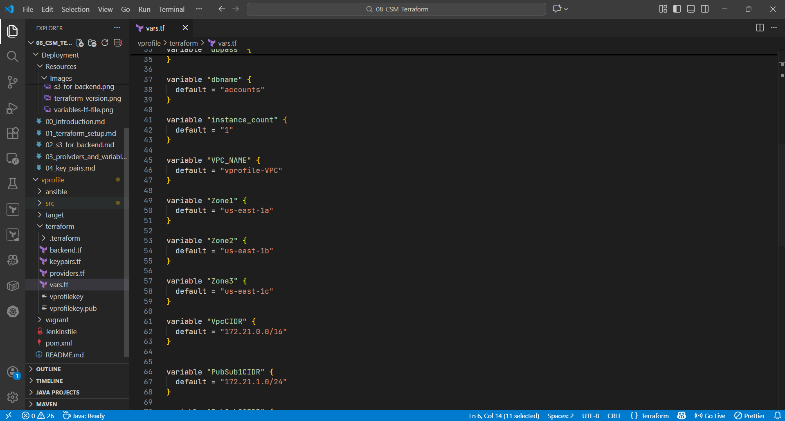
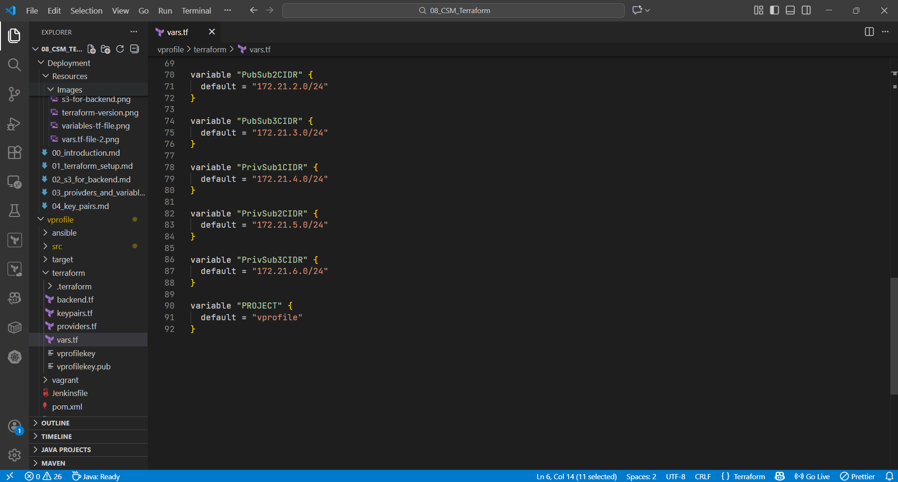

# Terraform Provider and Variables Configuration

This demonstrates how to **configure the Terraform provider** and **centralize all environment-specific values using variables**.
These configurations forms the **foundation** for every Terraform resource created later in the project.

### Files Created

Two core Terraform files are introduced:

1. **`providers.tf`** – Defines the cloud provider
2. **`vars.tf`** – Declares reusable variables used across the project

### Provider Configuration (`providers.tf`)

Terraform must know **which cloud platform** to interact with.
In this project, we use **Amazon Web Services** via **Terraform**.

#### Why Use a Separate Provider File?

- Keeps provider configuration isolated
- Improves readability and reuse
- Prevents hard-coding of sensitive values

### Variables Definition (`vars.tf`)

Terraform variables allow:

- Configuration reuse
- Clean separation of logic and values
- Easy environment changes (dev / stage / prod)
- Secure handling of sensitive data

In this project, variables are **defined upfront** to ensure smooth execution in later stages.

