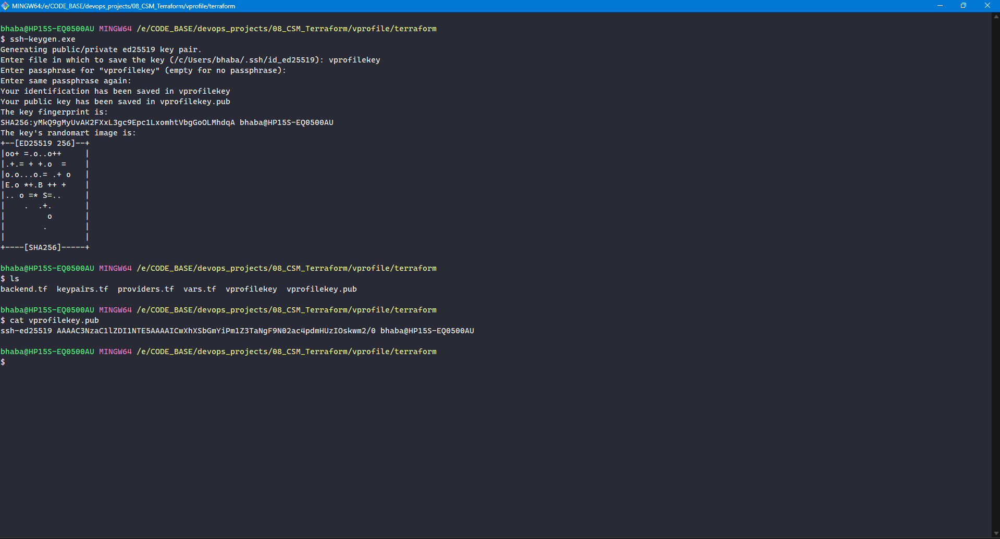
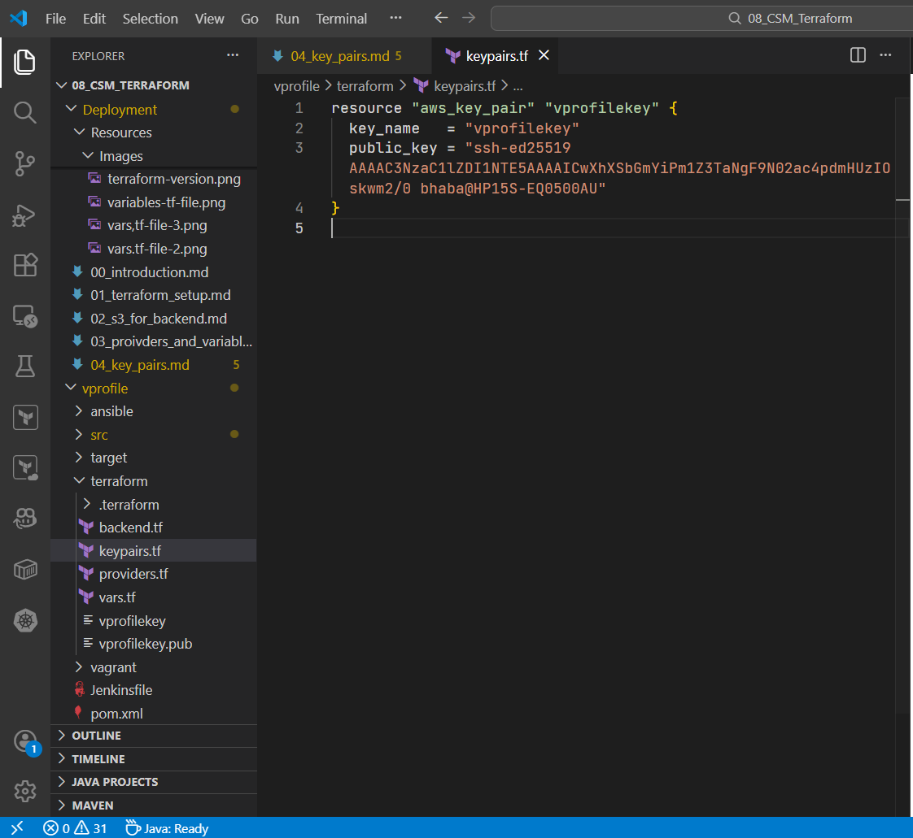
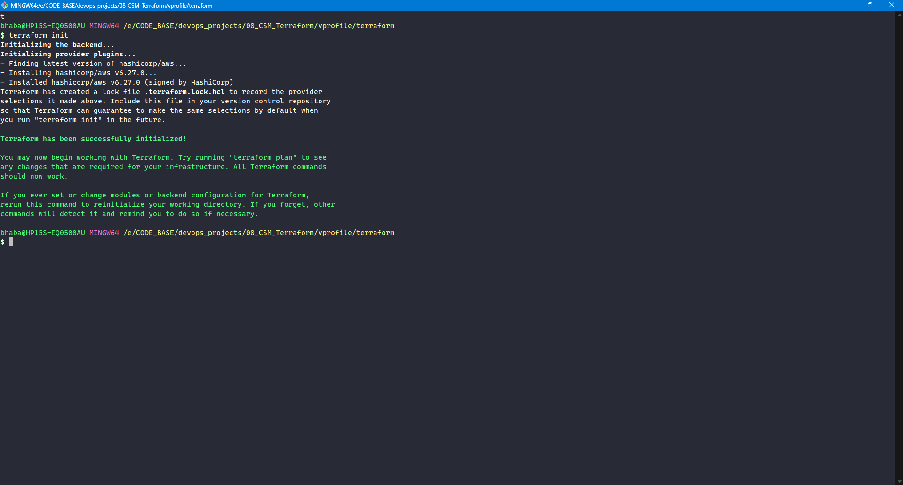
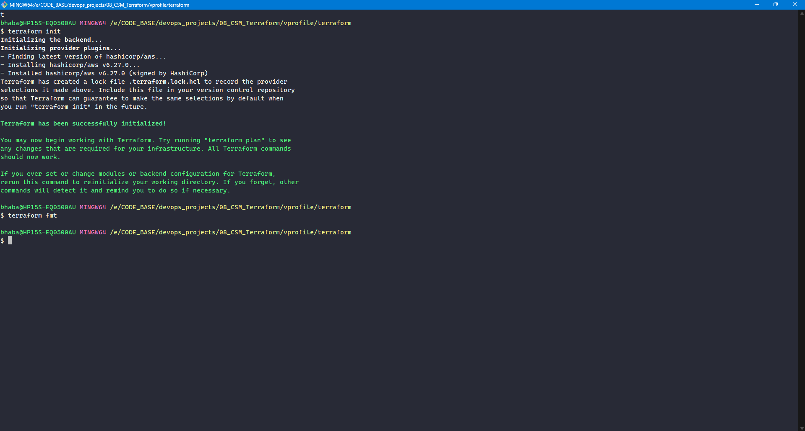
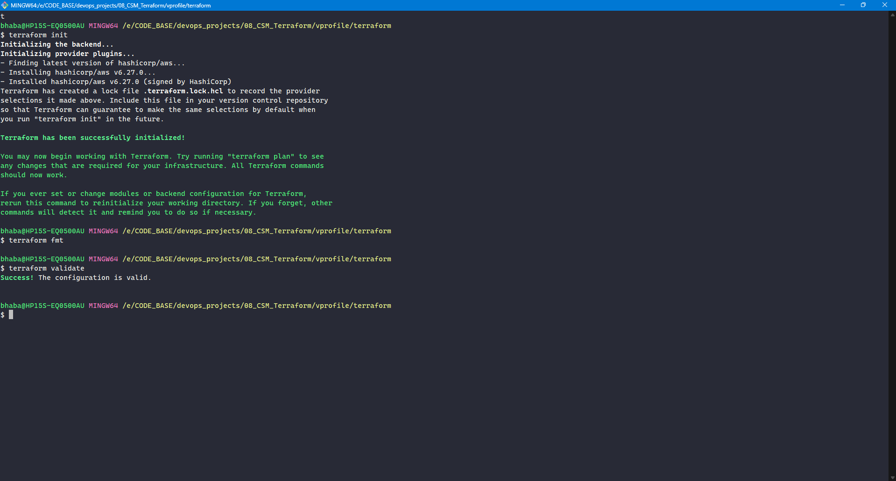
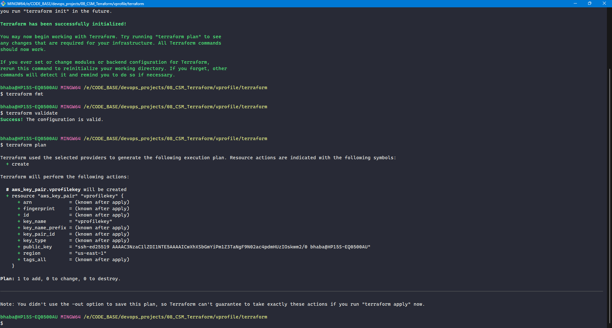
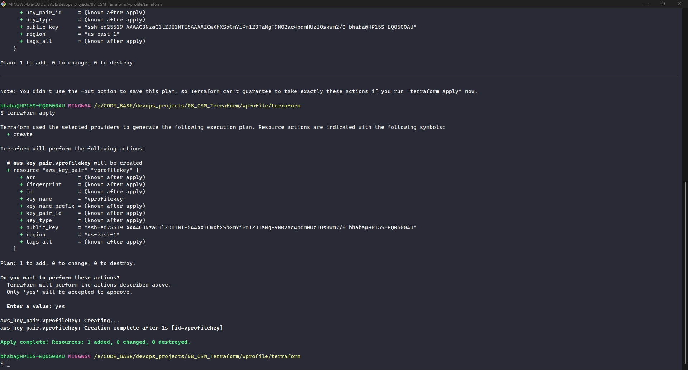
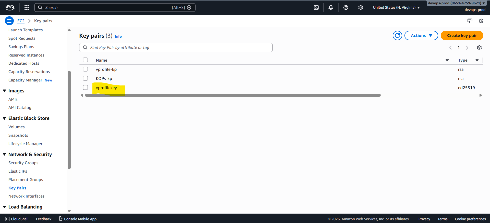

# Creating an EC2 Key Pair Using Terraform

now we create an **EC2 key pair** using **Terraform**.
This key pair is required to securely access:

- Bastion host (public subnet)
- Elastic Beanstalk EC2 instances (for troubleshooting)

### Why Key Pairs Are Required

- **Amazon EC2** instances require SSH keys for secure login
- Bastion hosts need SSH access for administration
- Elastic Beanstalk instances may require direct access during debugging
- Managing key pairs with Terraform ensures consistency and repeatability

### Step 1: Create `keypairs.tf`

Create a new file in your Terraform project directory:

```
keypairs.tf
```

Add the following resource block:

```hcl
resource "aws_key_pair" "vprofilekey" {
  key_name   = "vprofile-key"
  public_key = ""
}
```

⚠️ Leave `public_key` empty for now.

### Step 2: Generate SSH Key Pair Locally

From your terminal (inside the project directory), run:

```bash
ssh-keygen
```

When prompted:

- **File name**: `vprofile-key`
- **Passphrase**: Press Enter (leave empty)

This generates:

- `vprofile-key` → private key (keep secure)
- `vprofile-key.pub` → public key



### Step 3: Add the Public Key to Terraform

1. Open the file `vprofile-key.pub`
2. Copy the **entire content**
3. Paste it into `keypairs.tf`



### Step 4: Initialize Terraform

```bash
terraform init
```

This step:

- Initializes the AWS provider
- Connects to the remote S3 backend
- Downloads required plugins



### Step 5: Format and Validate Configuration

#### Format Terraform Files

```bash
terraform fmt
```

Ensures consistent formatting.



#### Validate Configuration

```bash
terraform validate
```

- Checks syntax
- Detects missing or invalid references
- Shows exact file and line numbers for errors



### Step 6: Review the Execution Plan

```bash
terraform plan
```

Verify the output carefully:

- Check **destroy actions first**
- Confirm only **add** actions exist

Expected result:

```
Plan: 1 to add, 0 to change, 0 to destroy
```

📌 Never apply a plan without reviewing it.



### Step 7: Apply the Configuration

```bash
terraform apply
```

Confirm when prompted:

```text
yes
```

Terraform will upload the public key and create the EC2 key pair.



### Step 8: Verify in AWS Console

Navigate to:

```
EC2 → Key Pairs
```

You should see:

```
vprofilekey
```


