# 🌐 Creating a VPC Using Terraform Modules

Now, we will create a **custom Virtual Private Cloud (VPC)** using **Terraform modules** instead of writing low-level AWS resources manually.

The VPC includes:

- 🌍 **3 Public Subnets**
- 🔒 **3 Private Subnets**
- 🌐 **Internet Gateway**
- 🔁 **NAT Gateway**
- 🧭 **Route Tables & Associations**
- 🧩 **DNS Support & Hostnames**

Using Terraform modules allows us to provision all of this with **minimal, clean, and reusable code**.

### ❓ Why Use Terraform Modules?

With modules:

- 📦 Modules are **pre-written and community-tested**
- 🧠 Best practices are already built in
- ⚡ Faster development
- 🛡️ Reduced configuration mistakes

In this project, we use the **official AWS VPC module**.

### 📦 Module Used

- **Source**: `terraform-aws-modules/vpc/aws`
- One of the **most widely used and production-tested** Terraform modules

This module automatically provisions:

- VPC
- Subnets
- Route tables
- Internet Gateway
- NAT Gateway(s)
- Elastic IP(s)

All from a **single module block**.

### 🏗️ Architecture Overview

- 🧱 **Custom VPC** with user-defined CIDR
- 🌍 **Public Subnets (3)**

  - Connected to Internet Gateway
  - Auto-assign public IPs

- 🔒 **Private Subnets (3)**

  - Outbound access via NAT Gateway

- 🔁 **Single NAT Gateway** (cost-optimized)
- 🧩 **DNS Hostnames & DNS Support enabled**

This VPC becomes the **foundation** for all services deployed later.

### 📄 File Created

#### `vpc.tf`

This file defines the entire VPC using a Terraform module.

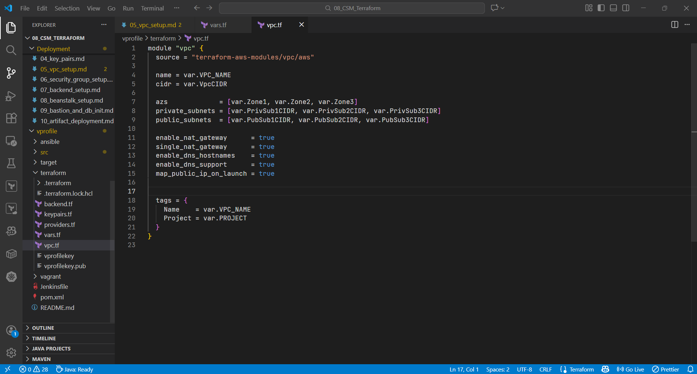

### 🚀 Terraform Execution Steps

#### 🔧 Initialize (Once)

```bash
terraform init
```

Downloads the VPC module and initializes the backend.

#### ✨ Format Code

```bash
terraform fmt
```

Ensures consistent formatting.

#### ✅ Validate Configuration

```bash
terraform validate
```

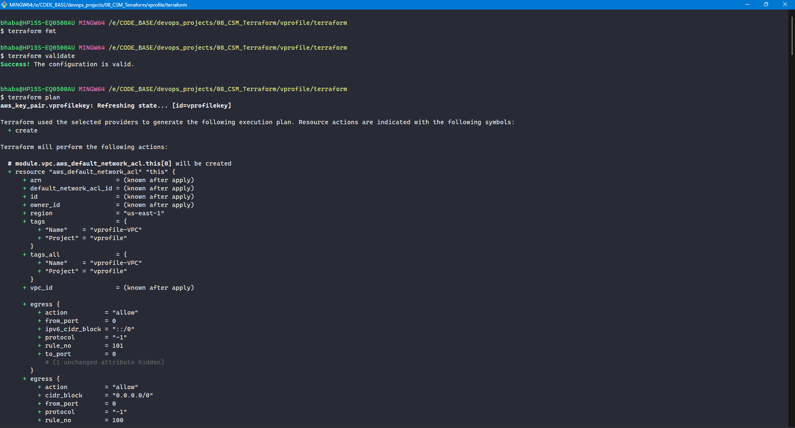

Detects syntax or reference issues early.

#### 🔍 Review Plan

```bash
terraform plan
```

Expected output (example):

```
Plan: 23 to add, 0 to change, 0 to destroy
```

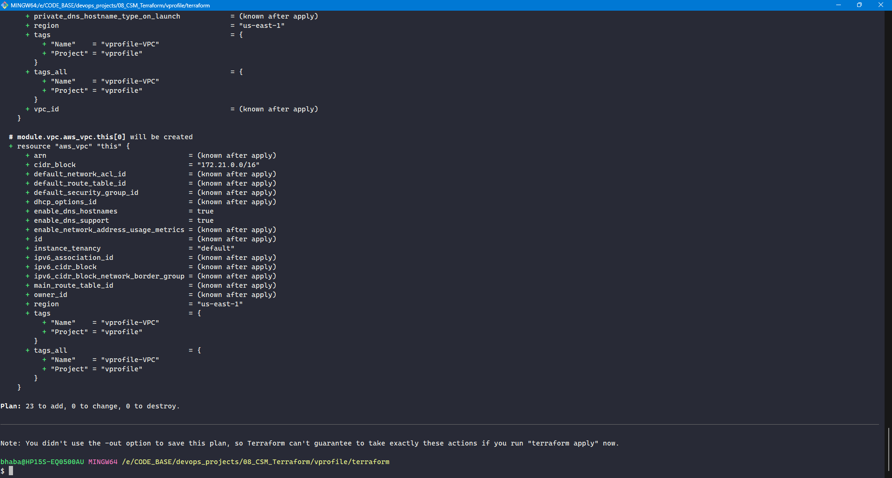

#### ⚠️ Apply (Creates Chargeable Resources)

```bash
terraform apply
```

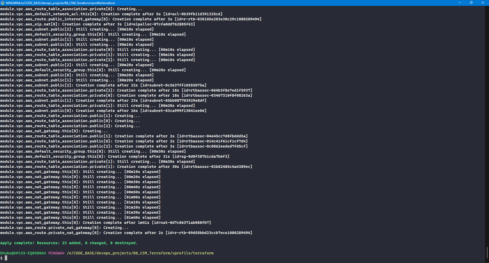

### AWS Console

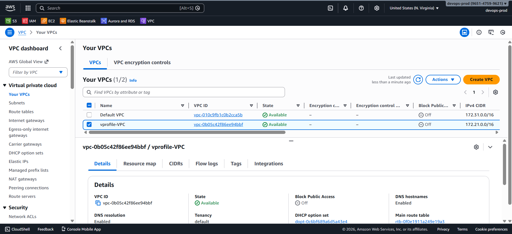

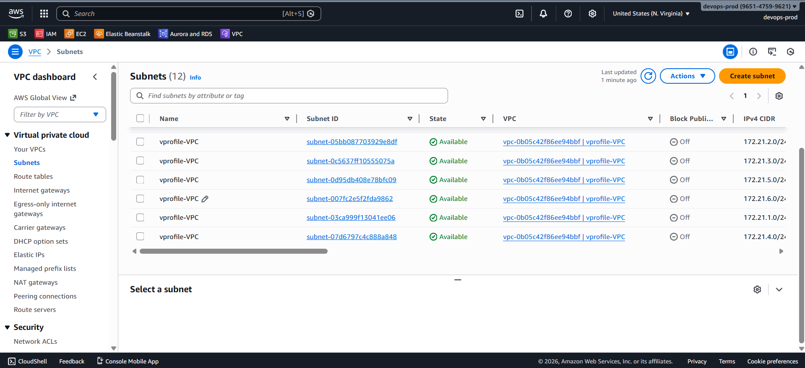

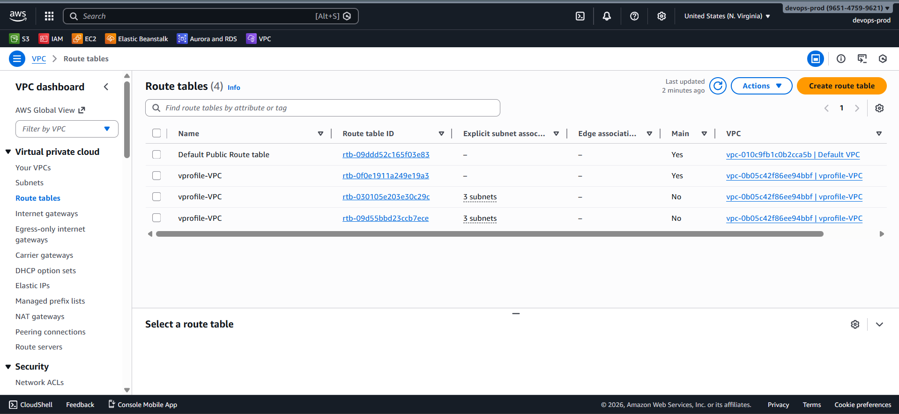

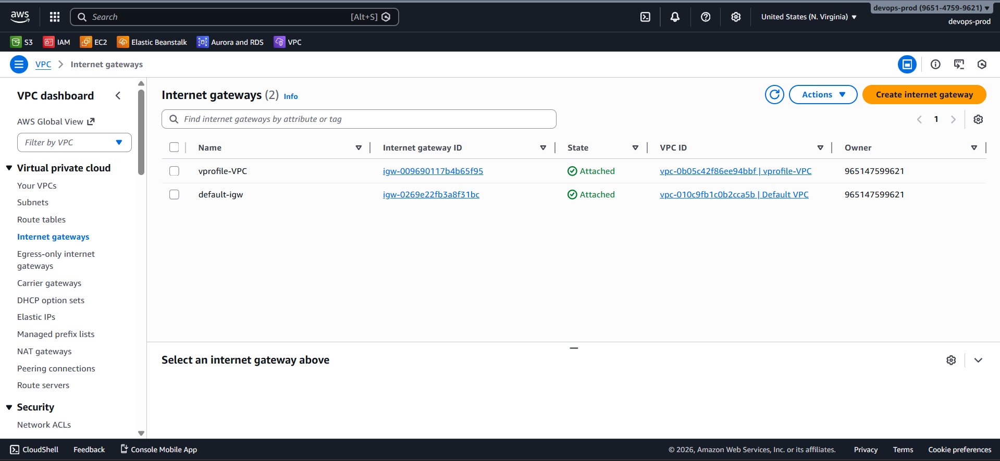

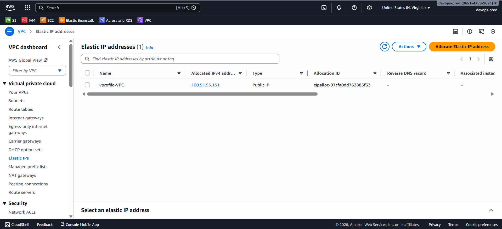

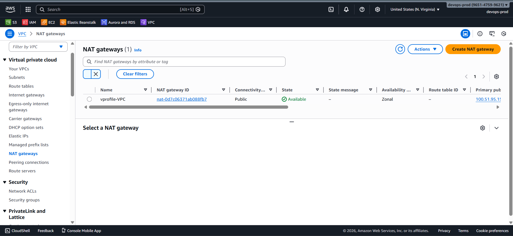

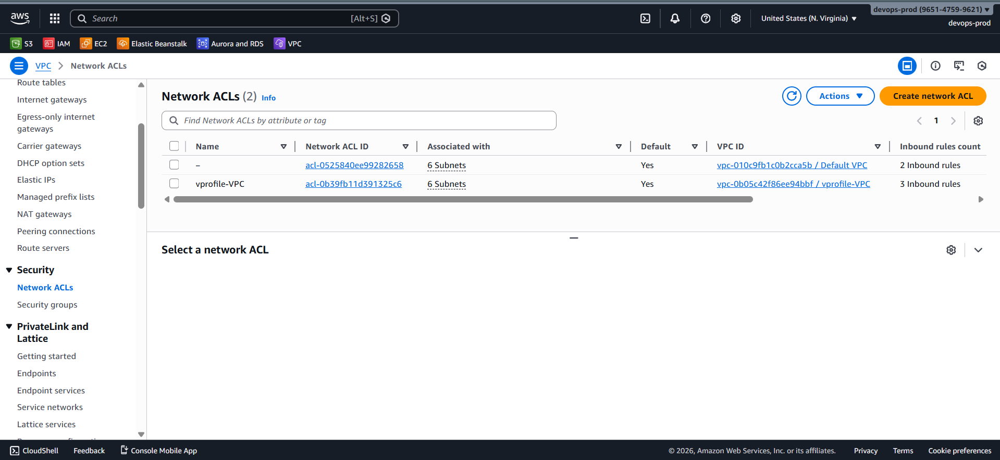
