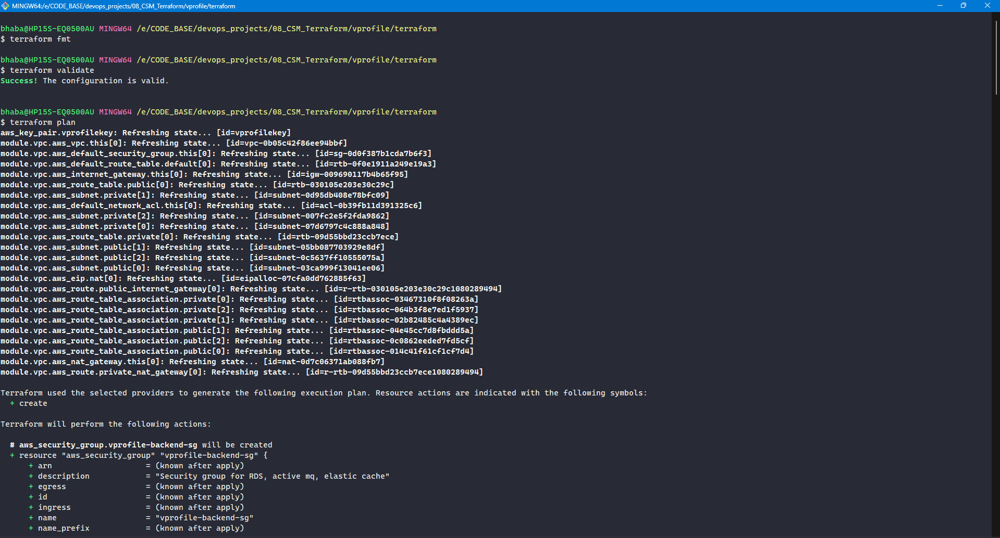
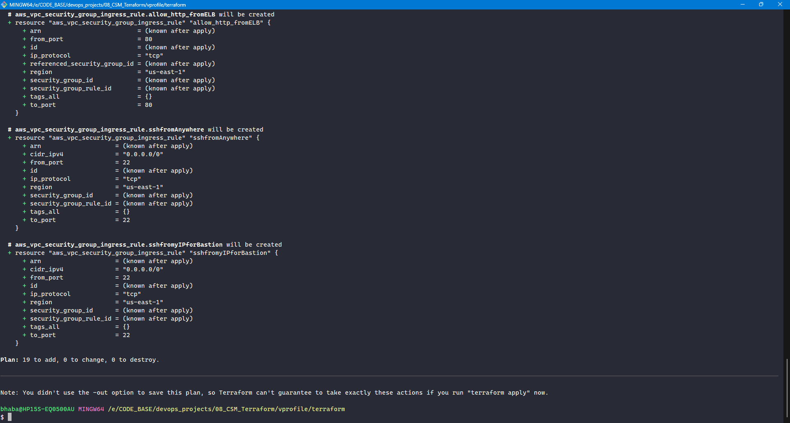
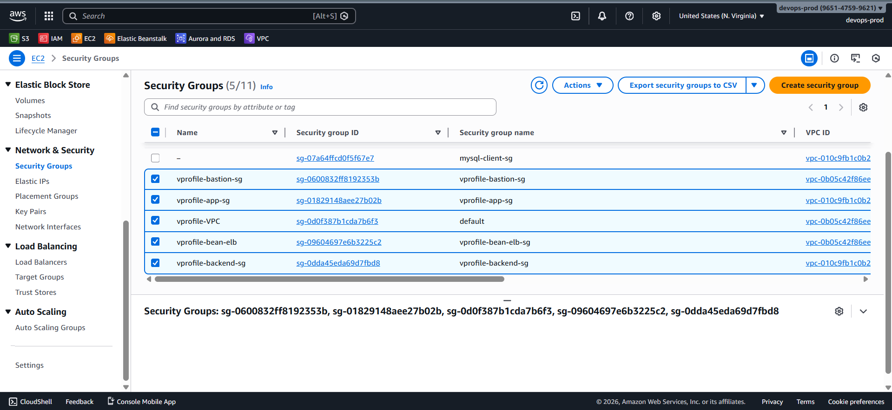

# 🔐 Creating Security Groups with Terraform

Now, we create **all required security groups** for the infrastructure using **Terraform**.

Security groups define:

- 🧭 **Who can talk to whom**
- 🔌 **On which ports**
- 🌐 **From which sources**

They are one of the **most critical and sensitive layers** in cloud infrastructure, so understanding **traffic flow and trust boundaries** is essential.

### 🧱 Security Groups Overview

We create **four security groups**, each with a clear responsibility.

#### 1️⃣ Load Balancer Security Group (ALB SG)

- Attached to the **Application Load Balancer**
- Public-facing
- Entry point for all HTTP traffic

#### 2️⃣ Application (Elastic Beanstalk EC2) Security Group

- Attached to **Elastic Beanstalk EC2 instances**
- Accepts traffic **only from the Load Balancer**
- Allows SSH access for administration

#### 3️⃣ Bastion Host Security Group

- Attached to a **public EC2 instance**
- Used to securely access **private backend resources**
- Acts as a controlled jump server

#### 4️⃣ Backend Security Group

- Used by backend services:

  - 🗄️ **Amazon RDS**
  - ⚡ **Amazon ElastiCache**
  - 📨 **Amazon MQ**

- Accepts traffic only from:

  - Beanstalk EC2 instances
  - Bastion host
  - Itself (internal backend communication)

### 🔄 Traffic Flow Summary

```
🌐 Internet
    ↓
🧱 Load Balancer SG (Port 80)
    ↓
🚀 Beanstalk EC2 SG (Port 80)
    ↓
🔒 Backend SG (Service Ports)
```

Additional access paths:

- 🔐 **SSH (22)** → Beanstalk & Bastion (from admin IP)
- 🗄️ **MySQL (3306)** → Bastion → RDS (DB initialization only)

### 🧩 Terraform Resource Design Pattern

Terraform uses **separate resources** for:

- Security group creation
- Ingress (inbound) rules
- Egress (outbound) rules

This approach provides:

- Fine-grained rule control
- Clear rule intent
- Easier debugging and maintenance
- Avoidance of rule replacement conflicts

### 📄 File Created

#### `secgrp.tf`

All security groups and their rules are defined in this file.

### ⚙️ Terraform Execution Steps

After writing `secgrp.tf`, run:

```bash
terraform init
terraform fmt
terraform validate
terraform plan
terraform apply
```





### AWS Console


