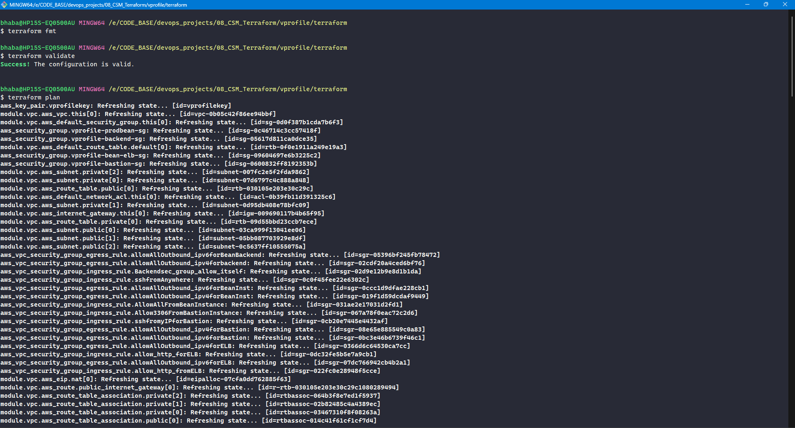
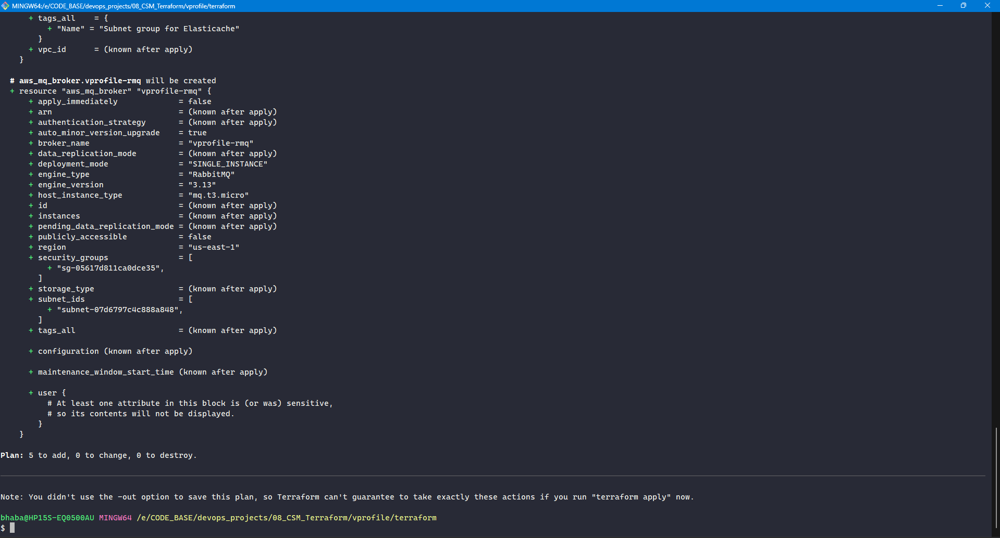
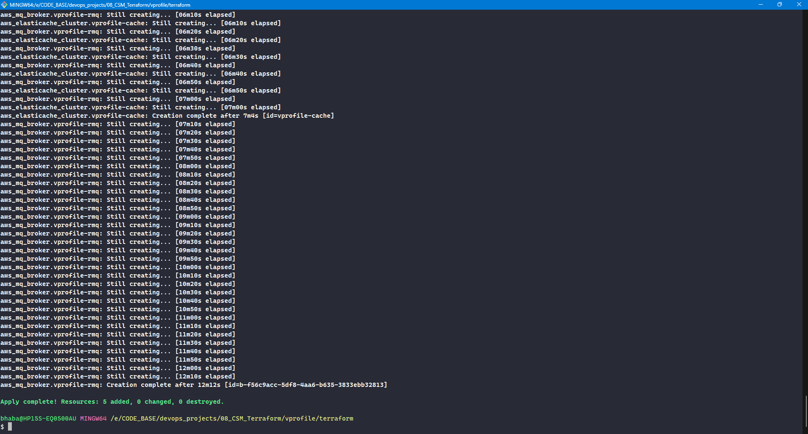
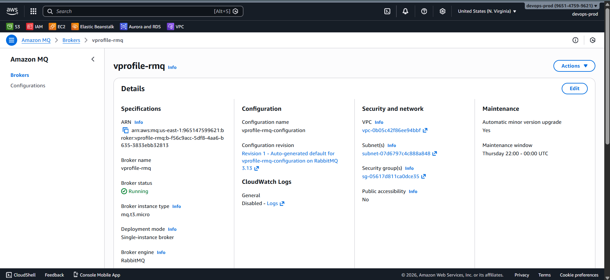
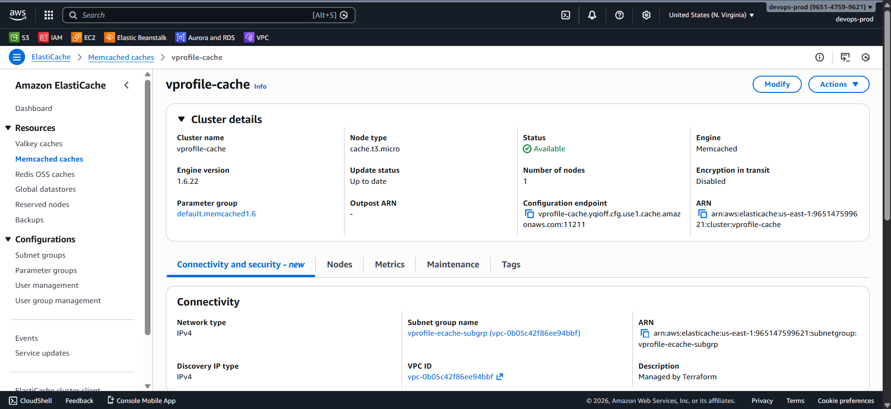
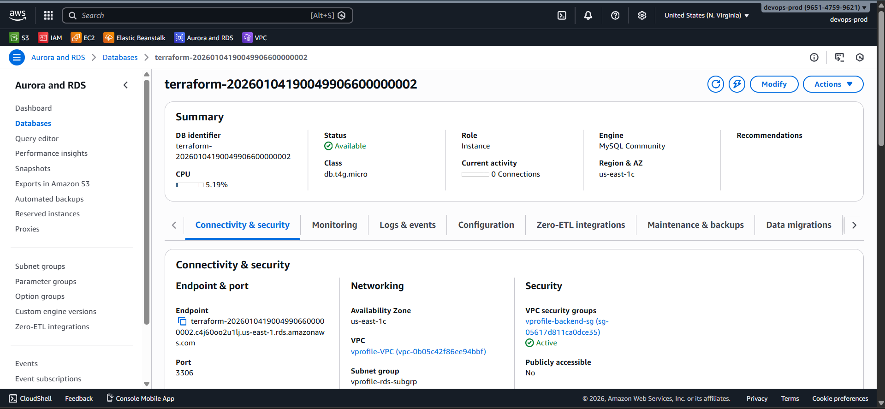

# 🗄️ Creating Backend Services with Terraform

Now, we provision **all backend services** for the application using **Terraform**.

The backend layer includes:

- 🐬 **Amazon RDS (MySQL)**
- ⚡ **Amazon ElastiCache (Memcached)**
- 📨 **Amazon MQ (RabbitMQ)**

All backend services are deployed:

- 🔒 Inside **private subnets**
- 🛡️ Attached to the **backend security group**
- 🚫 With **no public internet exposure**

### 🧩 Terraform Resources Used

| Service                  | Terraform Resource             |
| ------------------------ | ------------------------------ |
| RDS Subnet Group         | `aws_db_subnet_group`          |
| RDS Instance             | `aws_db_instance`              |
| ElastiCache Subnet Group | `aws_elasticache_subnet_group` |
| ElastiCache Cluster      | `aws_elasticache_cluster`      |
| Amazon MQ (RabbitMQ)     | `aws_mq_broker`                |

### 📄 File Created

#### `backend-services.tf`

All backend service resources are defined in this file.

### 🐬 1. Amazon RDS (MySQL)

#### 🔹 Step 1: Create DB Subnet Group

**Purpose**

- Forces RDS to launch only in **private subnets**
- Prevents accidental public exposure

**Key configuration**

- Subnets: `module.vpc.private_subnets[0..2]`
- Tagged for identification and management

#### 🔹 Step 2: Create RDS Instance

**Key settings**

- Engine: MySQL (8.x)
- Instance class: `db.t4g.micro` or `db.t3.micro`
- Storage: 20 GB (minimum)
- Database name: `accounts`
- Credentials: Terraform variables
- Multi-AZ: ❌ Disabled (cost optimization)
- Public access: ❌ Disabled
- Security group: Backend SG
- Subnet group: Custom DB subnet group
- Final snapshot: ❌ Disabled

##### ❓ Why skip final snapshot?

- Avoids leftover snapshots during repeated testing
- Prevents unexpected storage costs
- Suitable for learning and lab environments

### ⚡ 2. Amazon ElastiCache (Memcached)

#### 🔹 Step 1: Create ElastiCache Subnet Group

- Uses the same **private subnets** as RDS
- Required for launching cache nodes inside the VPC

#### 🔹 Step 2: Create Memcached Cluster

**Key settings**

- Engine: Memcached
- Version: 1.6.x
- Node type: `cache.t3.micro`
- Number of nodes: 1
- Port: `11211`
- Security group: Backend SG
- Subnet group: Custom ElastiCache subnet group

##### 🧠 How values were chosen

- Verified directly in the AWS Console
- Matches manual configuration options
- Ensures compatibility with the application

### 📨 3. Amazon MQ (RabbitMQ)

#### 🔹 Terraform Resource: `aws_mq_broker`

**Key settings**

- Broker engine: RabbitMQ
- Engine version: 3.13.x
- Instance type: `mq.t3.micro`
- Deployment mode: Single instance
- Subnet: Private subnet
- Security group: Backend SG
- Username & password: Terraform variables
- Public access: ❌ Disabled

#### ⚠️ Required Fix: Auto Minor Version Upgrade

RabbitMQ **requires** this setting:

```hcl
auto_minor_version_upgrade = true
```

Without it:

- Terraform will fail
- Broker creation will not proceed

This is a **service-specific constraint**, not a Terraform issue.

### ⚙️ Terraform Execution Steps

After completing `backend-services.tf`, run:

```bash
terraform init
terraform fmt
terraform validate
terraform plan
terraform apply
```







### AWS Console






