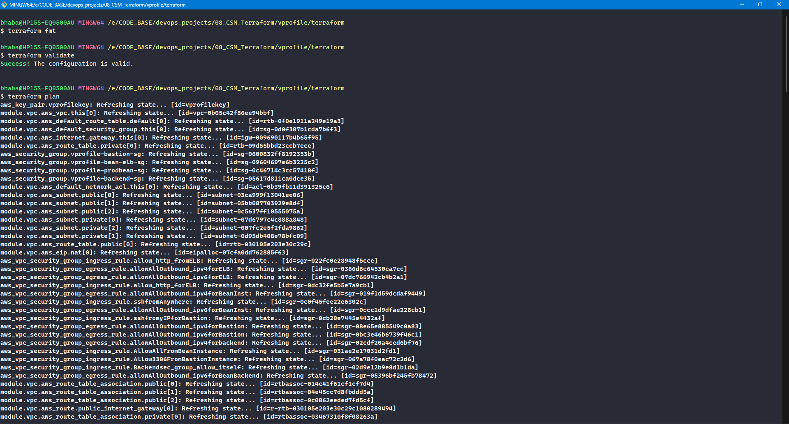
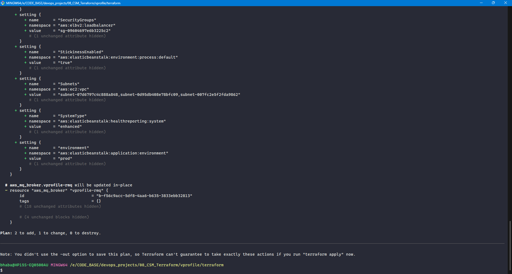
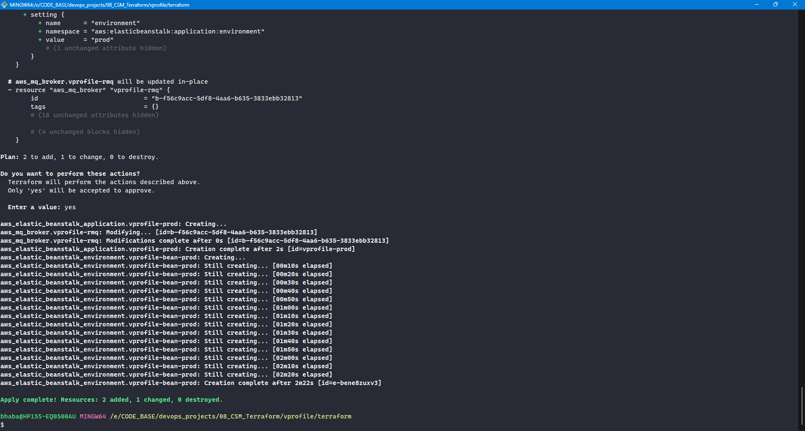
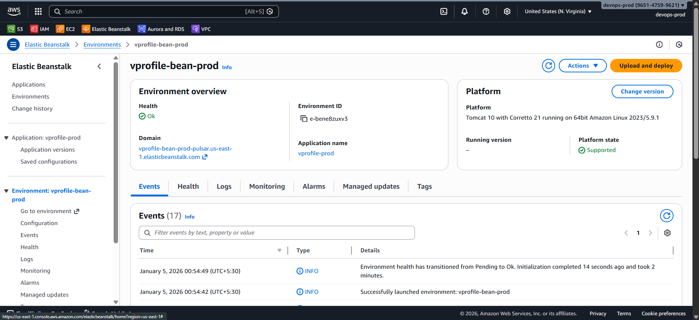

# 🖥️ Creating the Frontend (Elastic Beanstalk) with Terraform

Now, we will provision the **frontend layer** of the project using **AWS Elastic Beanstalk**.

Elastic Beanstalk hosts the **vProfile Java (Tomcat) application** and automatically manages:

- EC2 instances
- Auto Scaling Group
- Application Load Balancer
- Health checks and rolling deployments

All of this is integrated with the **VPC, subnets, and security groups** created earlier.

### 🧰 Terraform Resources Used

| Purpose               | Terraform Resource                  |
| --------------------- | ----------------------------------- |
| Beanstalk Application | `aws_elastic_beanstalk_application` |
| Beanstalk Environment | `aws_elastic_beanstalk_environment` |

### 📁 Files Created

| File          | Purpose                                                      |
| ------------- | ------------------------------------------------------------ |
| `bean-app.tf` | Creates the Elastic Beanstalk **application**                |
| `bean-env.tf` | Creates and configures the Elastic Beanstalk **environment** |

### 🧪 Solution Stack Name (Critical Step)

Elastic Beanstalk requires a **valid solution stack name**, which **changes over time**.

#### 🔍 How to Find the Correct Stack

1. Search: **Elastic Beanstalk Supported Platforms**
2. Select:

   - Tomcat
   - Amazon Linux
   - Corretto 21 (or 17)

3. Copy the **exact stack name**

#### ✅ Recommended

- Tomcat 10
- Corretto 21

⚠️ **Important**
Never hardcode old stack names.
If Terraform fails with _invalid solution stack_, re-check this value.

### 🌍 CNAME Prefix

- Must be **globally unique**
- Forms the public Beanstalk endpoint

Example:

```
vprofile-bean-prod-pulsar
```

### ⚙️ Beanstalk Environment Settings (Key Sections)

Elastic Beanstalk configuration is defined using **`setting` blocks**.

Each setting contains:

- `namespace`
- `name`
- `value`

### 🔐 IAM & Launch Template Configuration

#### ❓ Why This Is Required

- AWS deprecated **Launch Configurations**
- Beanstalk must use **Launch Templates**

#### 🔑 Key Settings

- IAM instance profile (pre-created role)
- Root volume type: `gp3`
- Disable IMDSv1 (enable IMDSv2)

### 🌐 VPC & Subnet Configuration

| Component     | Subnets Used        |
| ------------- | ------------------- |
| EC2 instances | **Private subnets** |
| Load balancer | **Public subnets**  |

#### ⚠️ Important

- Subnets must be provided as a **comma-separated string**
- Terraform `join()` is used

Example logic:

```hcl
join(",", module.vpc.private_subnets)
```

### 🖥️ Instance Configuration

| Setting            | Value                      |
| ------------------ | -------------------------- |
| Instance type      | `t3.micro`                 |
| Key pair           | Previously created EC2 key |
| Availability zones | Any 3                      |
| Min instances      | 1                          |
| Max instances      | 8                          |

### 🛡️ Security Groups

| Component     | Security Group |
| ------------- | -------------- |
| Beanstalk EC2 | Application SG |
| Load balancer | ELB SG         |

This ensures:

- Public traffic only reaches the load balancer
- Application instances remain private
- Backend access stays controlled

## 🚀 Deployment & Monitoring

| Setting           | Value    |
| ----------------- | -------- |
| Deployment policy | Rolling  |
| Health reporting  | Enhanced |
| Monitoring        | Enabled  |

These settings ensure:

- Zero-downtime deployments
- Safer rollouts
- Better observability

### ⛓️ Enforcing Resource Order (`depends_on`)

Elastic Beanstalk may create **default security groups** if custom ones are not ready.

To prevent this, `depends_on` is explicitly defined.

#### ❓ Why This Matters

- Ensures security groups exist **before** Beanstalk
- Prevents incorrect default attachments

Example:

```hcl
depends_on = [
  aws_security_group.vprofile_prod_bean_sg,
  aws_security_group.vprofile_bean_elb_sg
]
```

## ▶️ Terraform Execution Steps

Run from the project directory:

```bash
terraform init
terraform fmt
terraform validate
terraform plan
terraform apply
```







### AWS Console


