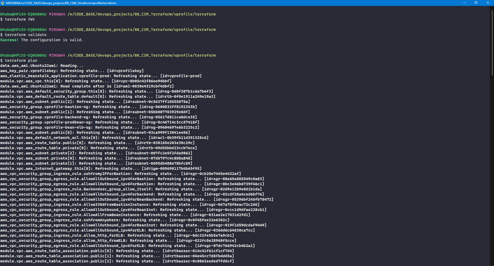
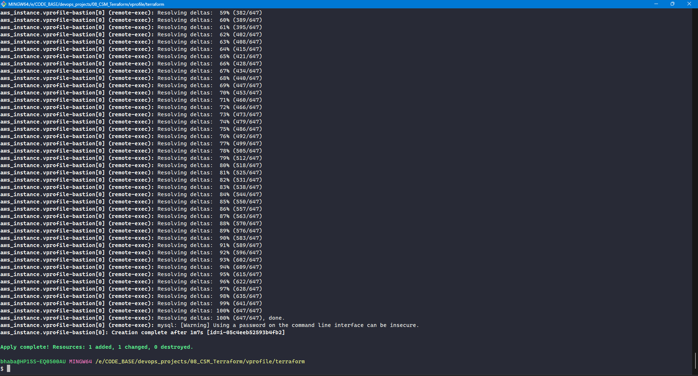
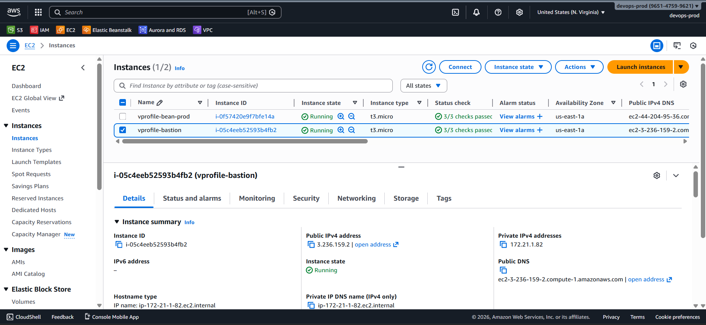

# 🛡️ Initializing RDS via Bastion Host (Terraform)

At this stage:

- ✅ **AWS Elastic Beanstalk** application & environment are **successfully created**
- ✅ Backend services (**RDS, ElastiCache, Amazon MQ**) are **running**
- ⏭️ Next required step: **initialize the RDS database schema**

### 🤔 Why a Bastion Host Is Required

- **Amazon RDS** is deployed in a **private subnet**
- It has **no public internet access**
- The only valid access path is:

```
Your Laptop → Bastion Host (Public Subnet) → RDS (Private Subnet)
```

So we will:

1. Launch an EC2 instance in a **public subnet**
2. SSH into it
3. Connect to RDS internally
4. Initialize the database schema

All of this is done **entirely using Terraform**.

### 🖥️ Step 1: Create Bastion Host EC2 (Terraform)

Create a new file:

```text
bastion-host.tf
```

📌 This instance:

- Lives in a **public subnet**
- Has **SSH access**
- Can reach private resources through security groups

### 🔍 Step 2: Dynamically Fetch Ubuntu 22 AMI

AMI IDs **change frequently** and **must never be hardcoded**.

Use a Terraform **data source**:

### 📄 Step 3: Database Initialization Script (Template)

Because the following values are **created dynamically**:

- RDS endpoint
- DB username
- DB password

We must use **Terraform templates**.

#### 📁 Create Templates Folder

```text
templates/
```

#### 📄 Create Template File

```text
templates/db-deploy.tmpl
```

### 🔄 Execution Flow (Very Important)

1. Terraform creates the **bastion EC2**
2. SSH connects using the private key
3. Script template is rendered with:

   - RDS endpoint
   - DB credentials

4. Script is pushed to `/tmp`
5. Script executes:

   - Installs MySQL client
   - Clones source code
   - Runs SQL schema against RDS

### ❗ Windows Line-Ending Issue (CRLF vs LF)

#### 🔥 Symptom

Terraform fails with messages like:

```text
invalid operation update
```

Script output shows:

```text
update: invalid operation
```

#### 🧠 Root Cause

- Script created on **Windows**
- Saved with **CRLF (DOS) line endings**
- Linux expects **LF**

On the EC2 instance:

```bash
:set ff?
→ fileformat=dos
```

### 🛠️ Fix (MANDATORY for Windows Users)

In **VS Code**:

1. Open `db-deploy.tmpl`
2. Bottom-right corner → click `CRLF`
3. Select **LF**
4. Save file

✅ Script is now Linux-compatible.






### AWS Completed


