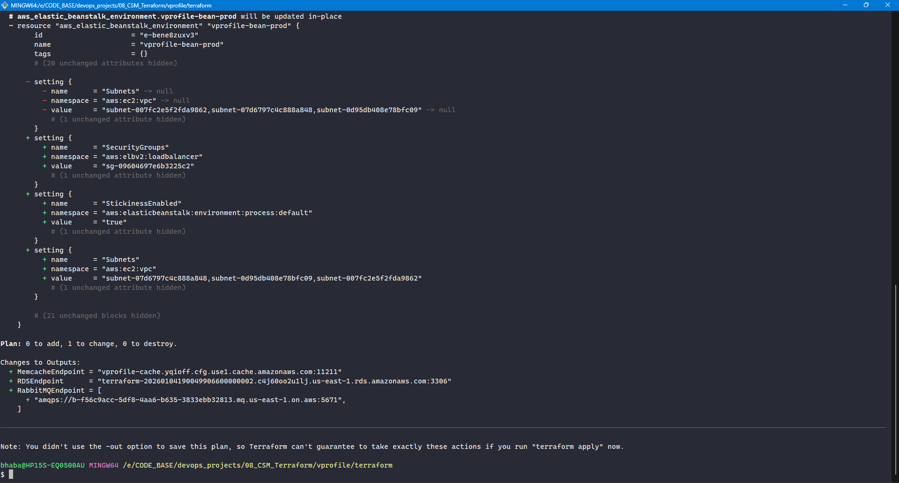
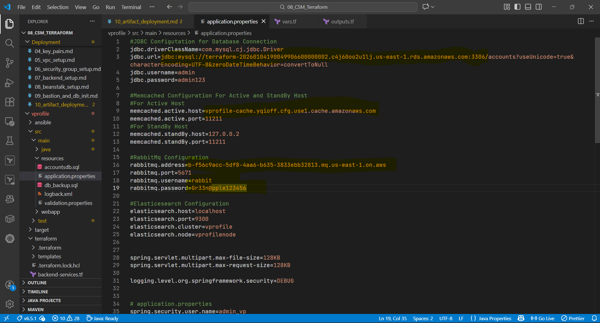
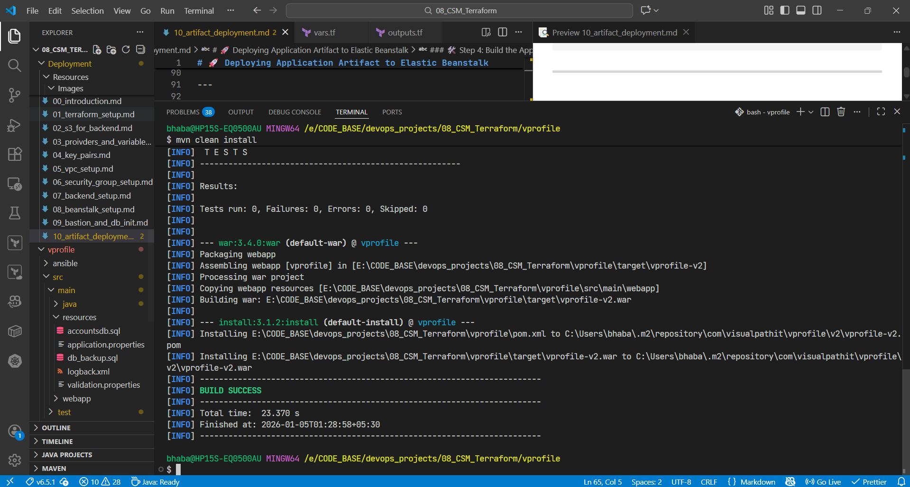
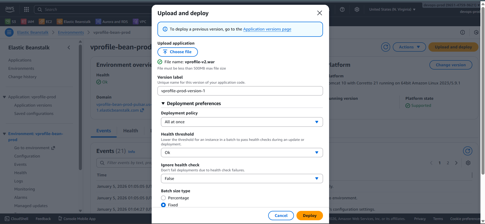
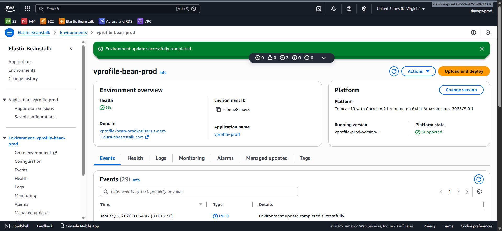
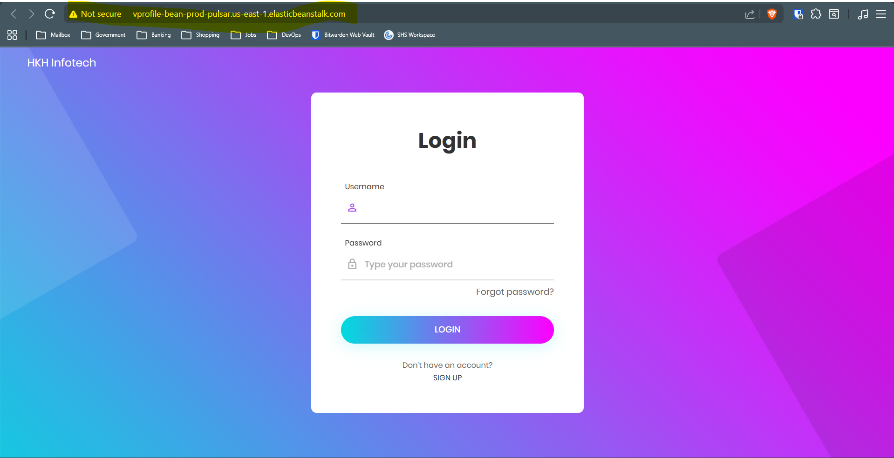
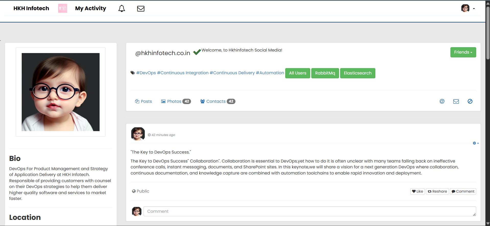
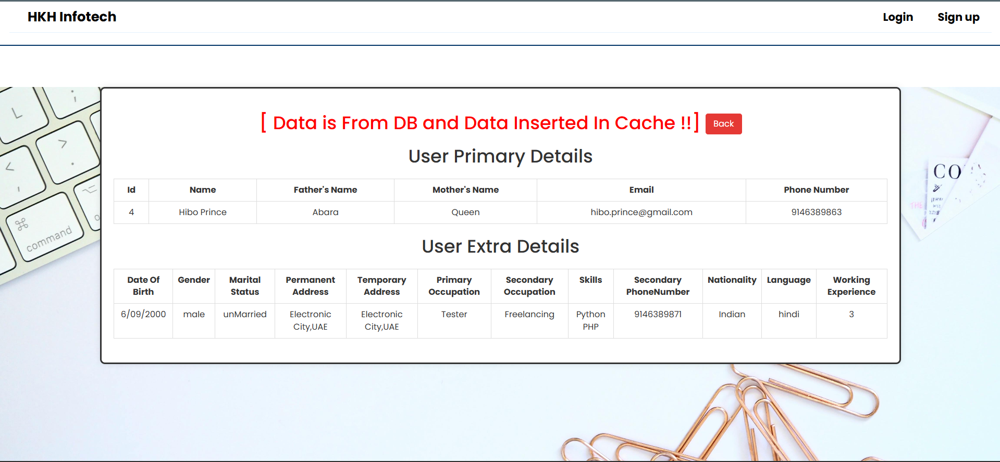
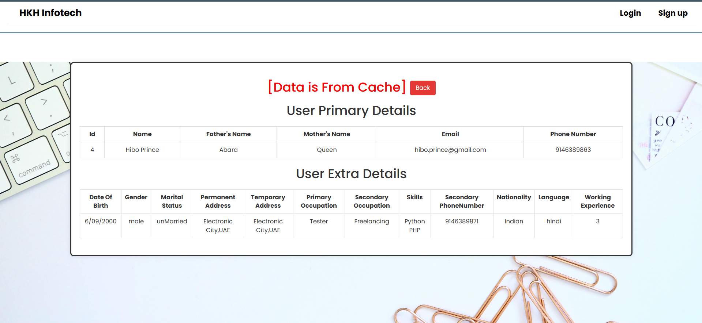
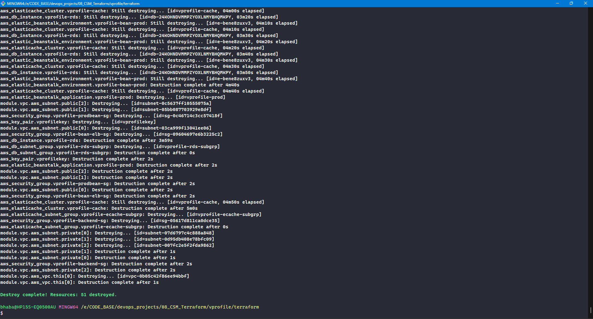

# 🚀 Deploying Application Artifact to Elastic Beanstalk

At this stage:

- ✅ Infrastructure is fully provisioned via **Terraform**
- ✅ Backend services are running:

  - **Amazon RDS**
  - **Amazon ElastiCache**
  - **Amazon MQ**

- ✅ Database schema has been initialized via **bastion host**
- ⏭️ **Next step:** Build the application artifact and deploy it to **AWS Elastic Beanstalk**

### 🔎 Step 1: Collect Backend Endpoints from Terraform

The application requires runtime endpoints for:

- MySQL (RDS)
- Memcached (ElastiCache)
- RabbitMQ (Amazon MQ)

To avoid hardcoding, we expose these using **Terraform outputs**.

---

### 📄 Create Terraform Outputs

Create a new file:

```text
outputs.tf
```

### 👀 View Endpoint Values

Run:

```bash
terraform plan
```

or

```bash
terraform output
```



### ⚙️ Step 3: Update `application.properties`

⚠️ **Important**

- No extra spaces
- Correct ports (`3306`, `11211`, `5671`)
- Copy endpoints **exactly** as Terraform outputs them

Save and exit.



### 🛠️ Step 4: Build the Application Artifact

#### ✅ Verify Tool Versions

- Java **17+**
- Maven **3.9+**

Check:

```bash
java -version
mvn -version
```

---

### 🏗️ Build the WAR File

```bash
mvn clean install
```

On success, the artifact is generated at:

```text
target/vprofile-v2.war
```



### ☁️ Step 5: Deploy Artifact to Elastic Beanstalk

1. Open **AWS Console → Elastic Beanstalk**

2. Select the **vprofile-prod** environment

3. Click **Upload and Deploy**

4. Choose the WAR file:

   ```text
   target/vprofile-v2.war
   ```

5. Deployment policy:

   - **All at once** (fastest for demo/testing)

6. Click **Deploy**

⏳ Wait until environment status becomes **Green / Healthy**.





### ✅ Step 6: Verify Application Functionality

Open the Elastic Beanstalk environment URL in a browser.

#### ✔️ Validate

- Application loads successfully
- Database reads/writes work
- Cache is reachable
- RabbitMQ messaging functions correctly

If login works, **all backend integrations are confirmed**.









### 🧹 Step 7: Destroy Infrastructure (IMPORTANT)

To avoid **unnecessary AWS charges**, destroy all resources after testing.

From the Terraform project directory:

```bash
terraform destroy
```

Type:

```text
yes
```

This removes:

- Elastic Beanstalk environment
- RDS instance
- ElastiCache cluster
- Amazon MQ broker
- Bastion host
- VPC, subnets, gateways, security groups


